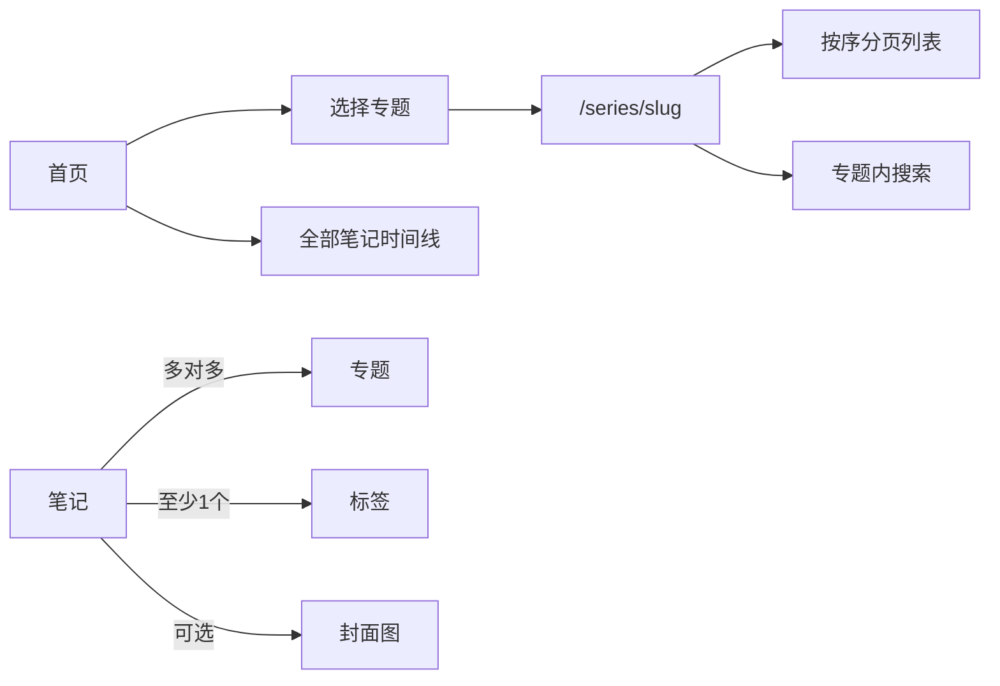
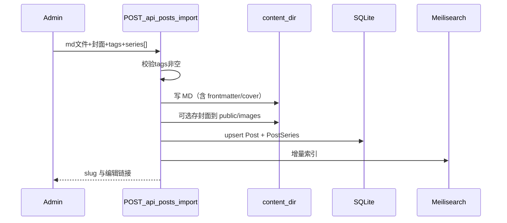

# 管理端与专题体系优化计划

> 状态：阶段 A–D 完成；阶段 E 文档与弃用标注完成（保留 `categories.ts` + 旧路径 301 一过渡期）  
> 依据确认（2026-07-14）：彻底取消分类；标签必填；多专题归属；MD 写入 `content/`；VPS 密钥仅存服务器 env；可选封面；zip 下载含全部引用图。

---

## 1. 目标概览

| 目标 | 说明 |
|------|------|
| 取消分类 | 删除 7 个预设分类与 `/{category}` 路由 |
| 标签必填 | 每篇至少 1 个 tag；存量保留，后台可改 |
| 多专题 | 一篇笔记可属于多个专题；专题内有顺序 |
| 首页专题 | 选专题 → 按序分页列表 + 篇数 + 专题内搜索 |
| 后台上传 MD | 写入 `content/` 并绑定 `filePath` |
| 封面 | 独立可选字段（上传图或不设封面） |
| 内容管理 | 标签/专题维护；笔记完整 zip 下载（MD + 图，路径可离线打开） |
| 发布 | 后台按钮触发 GitHub 同步 + VPS 部署（读服务器 `.deploy.env`，不落库） |

---

## 2. 信息架构（分类 → 专题）



**原则：**

- **标签**：横切主题，必填，用于筛选/搜索/图谱。
- **专题**：学习路径/合集，可选，多对多；同专题内用 `order` 排序。
- **不再存在「分类」**：删除 `lib/categories.ts` 预设与公开分类导航。

### 2.1 迁移策略（存量数据）

1. 已有 `tags`：**原样保留**；若为空则迁移时自动打上 `未分类标签` 或提示管理员补全（实现时选用：空标签自动加 `migration`，后台强制编辑时校验 ≥1）。
2. 已有 `series` + `seriesOrder`：写入多对多表，成为该专题下的一条成员关系。
3. 原 `category`：为每个曾用过的旧分类 **各建一个同名专题**（如「计算机视觉」），把原属该分类的笔记加入该专题；迁移完成后删除 `category` 字段。
4. `subcategory`：保留为可选「章节名」元数据（专题内分组展示仍可用）；不再表达「分类下的子类」。

### 2.2 Frontmatter（文件真相源）

```yaml
---
title: 标题
slug: my-slug
tags:                     # 必填，≥1
  - opencv
  - image-processing
series:                   # 可选，多专题
  - name: 传统计算机视觉
    order: 1
  - name: OpenCV 笔记
    order: 12
cover: /images/xxx.png    # 可选
status: published
publishedAt: 2026-07-14
summary: ...
outline: []
# 废弃：category
# subcategory 仍可选（章节）
subcategory: 第3章
---
```

兼容读取：旧 frontmatter 若仍有 `category: computer-vision` / 字符串 `series:`，sync 时自动按迁移规则转换后写回或仅入库。

---

## 3. 数据模型变更

### 3.1 Prisma（核心）

新增两个模型，弱化/移除 `Post.category`：

```prisma
model Series {
  id          String   @id           // slug，如 traditional-cv
  name        String   @unique
  description String?
  coverImage  String?
  createdAt   DateTime @default(now())
  updatedAt   DateTime @updatedAt
  posts       PostSeries[]
}

model PostSeries {
  postId   String
  seriesId String
  order    Int?     // 专题内顺序，越小越靠前
  post     Post     @relation(...)
  series   Series   @relation(...)
  @@id([postId, seriesId])
  @@index([seriesId, order])
}

model Post {
  // 移除 category；保留 subcategory?
  // 废弃字符串字段 series / seriesOrder（迁移后删除）
  coverImage  String?
  tags        String   // JSON 数组，应用层校验 length≥1
  memberships PostSeries[]
  ...
}
```

### 3.2 同步层

- 扩展 [`lib/content-sync.ts`](lib/content-sync.ts) / [`lib/markdown.ts`](lib/markdown.ts) `extractPostMeta`：解析多专题 + cover；写入 `PostSeries`。
- 反向：后台保存笔记时写回 MD frontmatter（文件绑定篇）。

---

## 4. 公开站改造

| 项 | 动作 |
|----|------|
| [`lib/categories.ts`](lib/categories.ts) | 删除或降为迁移用常量后移除 |
| [`app/(public)/[category]/`](app/(public)/[category]/) | 删除；新增 `app/(public)/series/page.tsx` 与 `series/[slug]/page.tsx` |
| Header / Sidebar | 去掉分类列表；改为「专题」入口与热门专题 |
| 首页 [`page.tsx`](app/(public)/page.tsx) | 专题选择器（全部 / 某专题）；专题模式下：总数、分页、顺序列表；`q`/`tag` 限定当前专题 |
| PostCard / Badge | 去掉 `badge-cat-*`；展示标签 + 所属专题 chips |
| 面包屑 / SEO / sitemap | 分类路径改为 `/series/[slug]` |
| 图谱 / 搜索筛选项 | category filter → series filter |

专题页行为：

- `GET /series/[slug]?page=&q=`
- 排序：`PostSeries.order ASC`，同序再按 `publishedAt DESC`
- 显示：`共 N 篇`；搜索只查该专题成员

---

## 5. 管理后台改造

### 5.1 新增/调整页面

| 页面 | 能力 |
|------|------|
| **上传笔记** `/admin/upload` | 选 `.md` → 解析 frontmatter → 表单补全：标签（必填，已有 chips + 新建）、专题（多选，已有/新建 + 每专题顺序）、封面（可选上传）、目标路径 `content/<dir>/<slug>.md` → 落盘 + DB + 可选触发 reindex |
| **笔记列表** `/admin/posts` | 筛标签/专题；编辑封面/标签/专题；下载 zip；删除 |
| **编辑器** | 分类下拉删除；标签必填校验；专题多选；封面上传/清除 |
| **标签管理** `/admin/tags` | 全局标签列表、重命名/合并/删除（更新所有帖子 JSON） |
| **专题管理** `/admin/series` | 创建/改名/封面/描述；成员列表与拖拽或数字排序 |
| **设置** `/admin/settings` | 保留 sync/reindex；新增「推送到 GitHub」「部署到 VPS」按钮（调服务端脚本，读 `.deploy.env`） |

### 5.2 上传入库流程（确认方案 A）



### 5.3 封面

- 字段：`Post.coverImage`（如 `/images/covers/{slug}.webp`）
- 上传可走现有 [`/api/upload`](app/api/upload/route.ts) 或专用 covers 目录；列表/OG/文首优先用该字段，无则回退正文首图。

### 5.4 完整 zip 下载

`GET /api/posts/[slug]/export`（需登录）：

1. 取 MD 正文与 `filePath`（无文件则用 DB content 生成临时 md）
2. 解析引用：相对路径、`/images/*`、`/uploads/*`、可选绝对站内 URL
3. 打 zip 结构建议：

```text
{slug}/
  {slug}.md          # 图片路径改写为相对 ./assets/...
  assets/
    cover.png
    img1.png
    ...
```

4. 响应 `application/zip`；保证解压后本地打开 MD 图片路径正确。

### 5.5 GitHub / VPS 按钮（确认方案：env，不落库）

- 新 API：`POST /api/admin/publish`（admin session + 可选 confirm）
  - 动作：`git add content public/images` → commit → `push`（服务器需配置 deploy key）
  - 或拆开：「仅 git 同步」「仅 VPS 部署」
- VPS：在容器内/宿主机执行与 [`scripts/deploy-vps.py`](scripts/deploy-vps.py) 等价逻辑，读取**宿主机** `.deploy.env`（compose 挂载或 `deploy` sidecar）
- **注意**：当前 Docker 应用容器未必能访问宿主机 Docker/SSH/GitHub；实现默认：
  - **推荐实现**：API 写入「发布任务」或 `exec` 宿主机已部署的 hook 脚本（文档约定路径，如 `/var/www/blog/Zoo-Blog/scripts/deploy-vps.py`）
  - 若容器内无法部署：按钮调用配置项 `DEPLOY_HOOK_URL`（本地 runner）或提示「仅在 VPS 宿主机 PM2/本机管理员环境启用」
- 界面不展示、不保存密码；仅显示「已配置 / 未配置」（检查 `VPS_HOST` 等是否存在）

安全：仅 `ADMIN` 角色；rate limit；审计日志（谁在何时触发）。

---

## 6. API 清单（拟定）

| 方法 | 路径 | 说明 |
|------|------|------|
| POST | `/api/posts/import` | 上传 MD + 元数据入库 |
| PATCH | `/api/posts/[slug]` | 扩展 cover、多专题 |
| GET | `/api/posts/[slug]/export` | zip 下载 |
| GET/POST/PATCH/DELETE | `/api/series` | 专题 CRUD |
| PATCH | `/api/series/[id]/members` | 成员顺序 |
| GET/PATCH | `/api/tags` | 标签列表/重命名合并 |
| POST | `/api/admin/git-sync` | 推送 GitHub |
| POST | `/api/admin/deploy-vps` | 触发 VPS 部署 |
| GET | `/api/admin/deploy-status` | env 是否就绪、上次结果 |

---

## 7. 实施阶段

### 阶段 A — 数据与同步基础（优先）

1. Prisma：`Series` / `PostSeries` / `coverImage`；迁移脚本从旧 category/series 灌数据  
2. 更新 content-sync + frontmatter 解析/写回  
3. tags 校验 ≥1  

**验收**：旧笔记可读；DB 中无依赖 category 查询。

### 阶段 B — 公开站专题化

1. 删除 `[category]`；新增 `/series`、`/series/[slug]`  
2. 首页专题选择 + 分页 + 专题内搜索  
3. Header/Sidebar/Badge/SEO/sitemap  

**验收**：无分类入口；专题阅读顺序与篇数正确。

### 阶段 C — 管理后台上传与元数据

1. `/admin/upload` + import API  
2. 编辑器/列表：标签必填、多专题、封面  
3. `/admin/tags`、`/admin/series`  
4. zip export  

**验收**：上传一篇含图 MD，线上可见；zip 解压本地预览出图。

### 阶段 D — 发布按钮

1. git-sync / deploy-vps API + Settings UI  
2. 文档：VPS 上 deploy key、`.deploy.env`、hook 挂载说明（更新《笔记上传手册》）  

**验收**：点按钮后 GitHub 有 commit、VPS 容器更新。

### 阶段 E — 清理

1. 删除死代码：`categories.ts`、badge-cat CSS、旧字段  
2. 更新 WRITING.md / README / CHANGELOG  
3. 全量测试 + 构建  

---

## 8. 风险与约束

| 风险 | 应对 |
|------|------|
| 外链 `/ai`、`/computer-vision` 失效 | 临时 301 → 对应迁移生成的专题页；或维护 `legacyCategoryRedirects` 一期 |
| Docker 内无法 `docker compose`/`ssh` | 发布按钮走宿主机脚本/hook，文档写清 |
| 多专题 frontmatter 旧文不兼容 | sync 双读旧/新格式一个版本周期 |
| 文件绑定笔记后台改元数据 | 必须写回 MD，避免下次 sync 冲掉 |
| zip 路径穿越 | 仅允许站内 `content/images/uploads` 前缀 |

---

## 9. 不在本期范围

- 把 VPS 密码配进管理后台数据库  
- 仅 DB、不写 `content/` 的上传模式  
- RAG/图谱大改（仅把 category 筛选换成 series）  
- 自动从 Word 一键成帖（现有附件抽文本可后续接）

---

## 10. 建议工期（单人参考）

| 阶段 | 预估 |
|------|------|
| A 数据与 sync | 2–3 天 |
| B 公开站 | 2 天 |
| C 管理端上传/标签专题/zip | 3–4 天 |
| D 发布按钮 + 运维文档 | 1–2 天 |
| E 清理与回归 | 1 天 |

---

## 11. 已确认决策摘要

1. **分类**：彻底删除；标签必填；多专题；首页专题浏览 + 分页 + 计数 + 专题内搜索。  
2. **上传**：写入 `content/` + `filePath`。  
3. **密钥**：仅 `.env` / `.deploy.env`；后台只触发按钮。  
4. **封面**：独立可选字段。  
5. **zip**：含相对路径图 + `/images` + `/uploads`，改写相对路径保证本地可看。

---

下一步：评审本计划后，按 **阶段 A → B → C → D → E** 开工。若需调整迁移时「旧分类是否自动建成专题」的默认行为，可在开工前说明。
